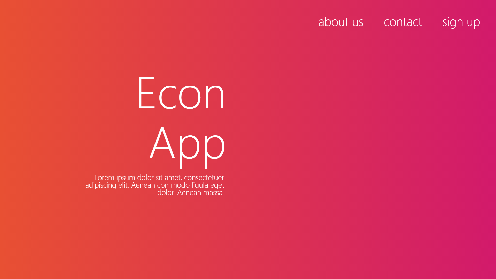
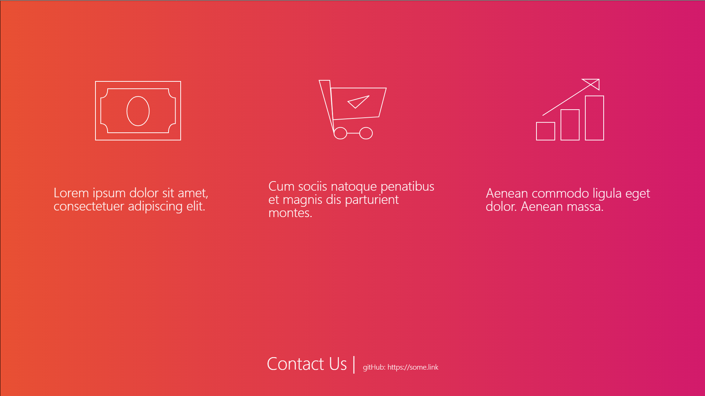
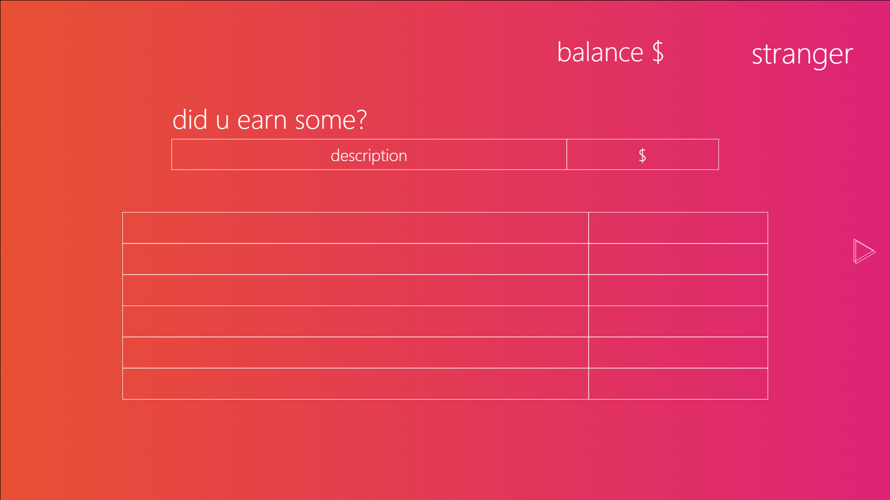
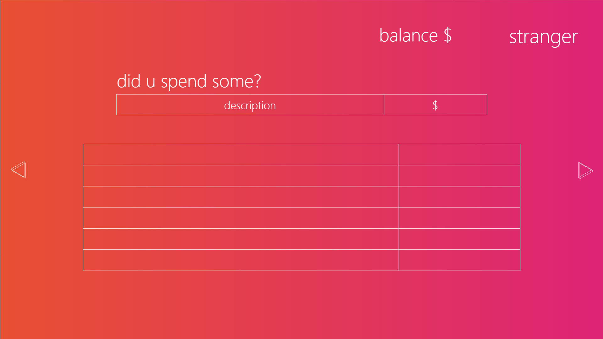
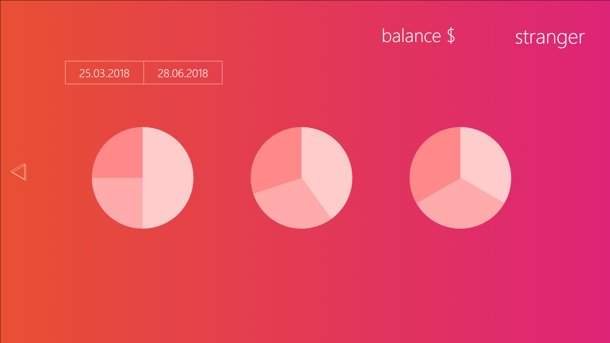

### Курс по командной разработке

#### Тема проекта : веб-приложение для контроля за доходами и расходами.

#### Кому это нужно?
   Всем желающим следить за своими доходами и расходами. 
   Даже если это кот.
   
#### Примерный вид приложения :

#### Кто в команде? 
- Гусев Михаил, ИУ7-83 https://github.com/MikeGus
- Уточкина Наталия, ИУ7-83 https://github.com/Unatart

#### Технологический стек
- Back end : Flask + Peewee (PostgreSQL orm)
- Front end : html5, css3, js
- CodeStyle : http://google.github.io/styleguide/
- Инструмент для разработки : PyCharm, WebStorm
- БагТрекер : GitHub
